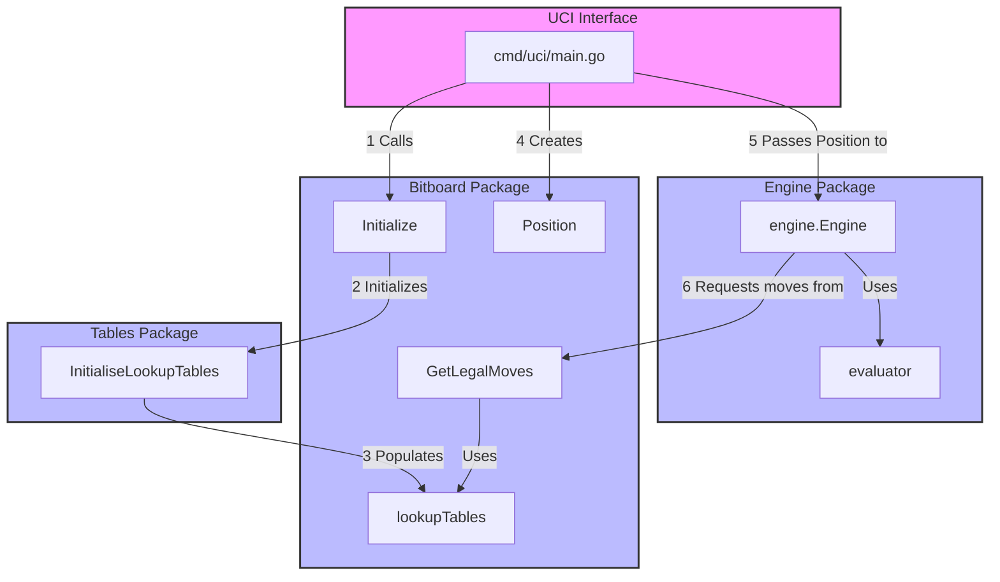

```mermaid
flowchart TD
    subgraph UCI["UCI Interface"]
        MAIN[cmd/uci/main.go]
    end

    subgraph ENGINE["Engine Package"]
        ENG[engine.Engine]
        EVAL[evaluator]
    end

    subgraph BITBOARD["Bitboard Package"]
        BB_INIT[Initialize]
        POS[Position]
        MOVES[GetLegalMoves]
        TABLES[lookupTables]
    end

    subgraph TABLES_PKG["Tables Package"]
        T_INIT[InitialiseLookupTables]
    end

    %% Initialization flow
    MAIN -->|1 Calls| BB_INIT
    BB_INIT -->|2 Initializes| T_INIT
    T_INIT -->|3 Populates| TABLES

    %% Runtime flow
    MAIN -->|4 Creates| POS
    MAIN -->|5 Passes Position to| ENG
    ENG -->|6 Requests moves from| MOVES
    MOVES -->|Uses| TABLES
    ENG -->|Uses| EVAL

    style UCI fill:#f9f,stroke:#333,stroke-width:2px
    style ENGINE fill:#bbf,stroke:#333,stroke-width:2px
    style BITBOARD fill:#bbf,stroke:#333,stroke-width:2px
    style TABLES_PKG fill:#bbf,stroke:#333,stroke-width:2px
```
