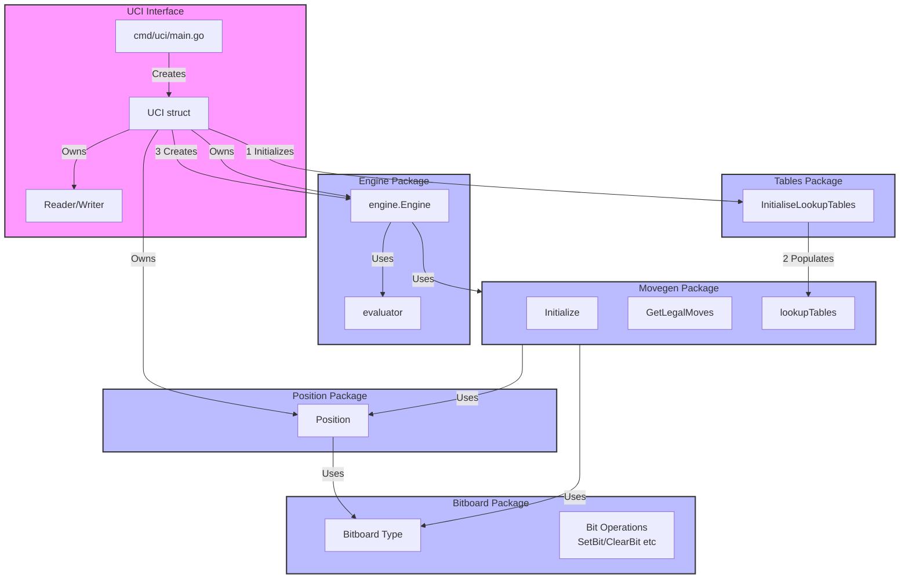

```mermaid
flowchart TD
    subgraph UCI["UCI Interface"]
        MAIN[cmd/uci/main.go]
        UCI_STRUCT[UCI struct]
        IO[Reader/Writer]
    end

    subgraph ENGINE["Engine Package"]
        ENG[engine.Engine]
        EVAL[evaluator]
    end

    subgraph BITBOARD["Bitboard Package"]
        BB[Bitboard Type]
        BB_OPS[Bit Operations<br>SetBit/ClearBit etc]
    end

    subgraph POSITION["Position Package"]
        POS[Position]
    end

    subgraph MOVEGEN["Movegen Package"]
        MG_INIT[Initialize]
        MOVES[GetLegalMoves]
        TABLES[lookupTables]
    end

    subgraph TABLES_PKG["Tables Package"]
        T_INIT[InitialiseLookupTables]
    end

    %% Initialization flow
    MAIN -->|"Creates"| UCI_STRUCT
    UCI_STRUCT -->|"1 Initializes"| T_INIT
    T_INIT -->|"2 Populates"| TABLES
    UCI_STRUCT -->|"3 Creates"| ENG

    %% Component relationships
    UCI_STRUCT -->|"Owns"| IO
    UCI_STRUCT -->|"Owns"| POS
    UCI_STRUCT -->|"Owns"| ENG
    
    %% Dependencies between packages
    POS -->|"Uses"| BB
    MOVEGEN -->|"Uses"| POS
    MOVEGEN -->|"Uses"| BB
    ENG -->|"Uses"| MOVEGEN
    ENG -->|"Uses"| EVAL

    %% Style
    style UCI fill:#f9f,stroke:#333,stroke-width:2px
    style ENGINE fill:#bbf,stroke:#333,stroke-width:2px
    style BITBOARD fill:#bbf,stroke:#333,stroke-width:2px
    style POSITION fill:#bbf,stroke:#333,stroke-width:2px
    style MOVEGEN fill:#bbf,stroke:#333,stroke-width:2px
    style TABLES_PKG fill:#bbf,stroke:#333,stroke-width:2px
```
